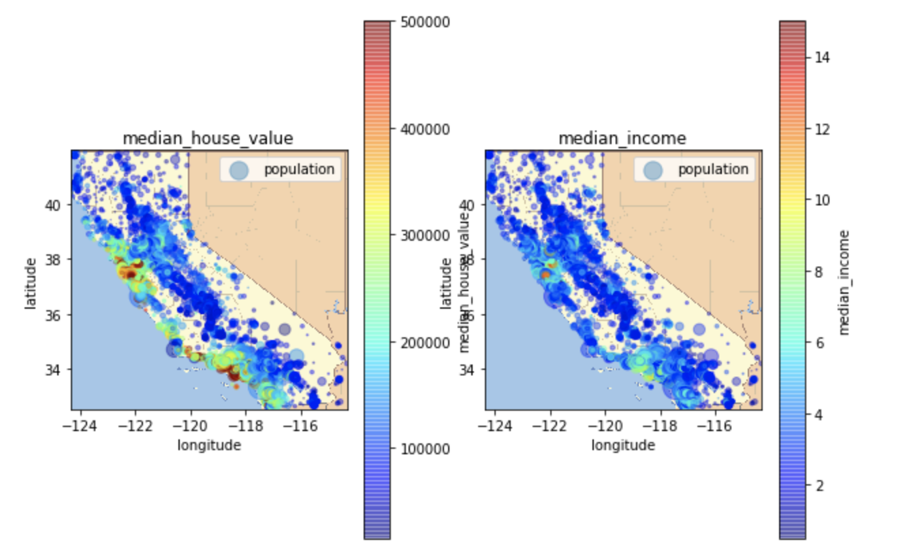
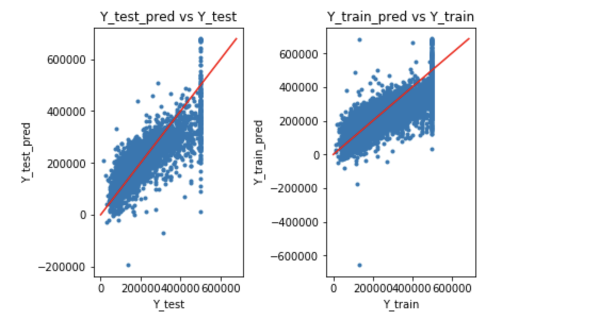
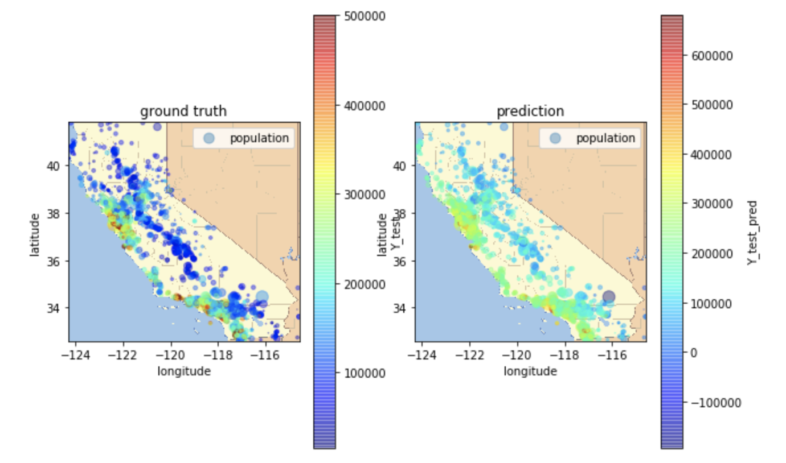
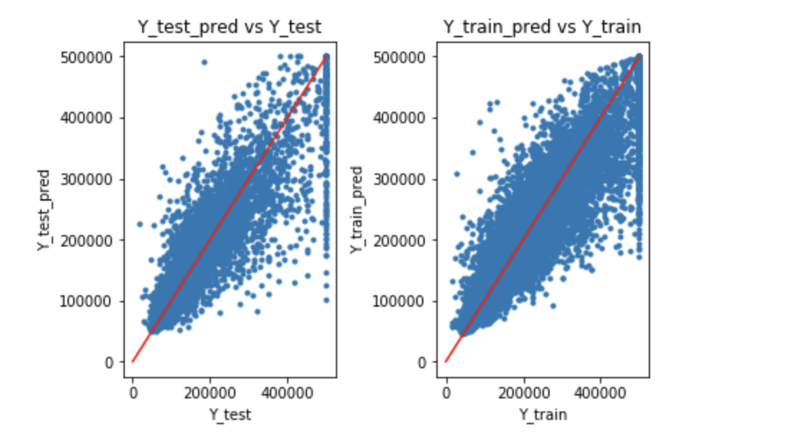
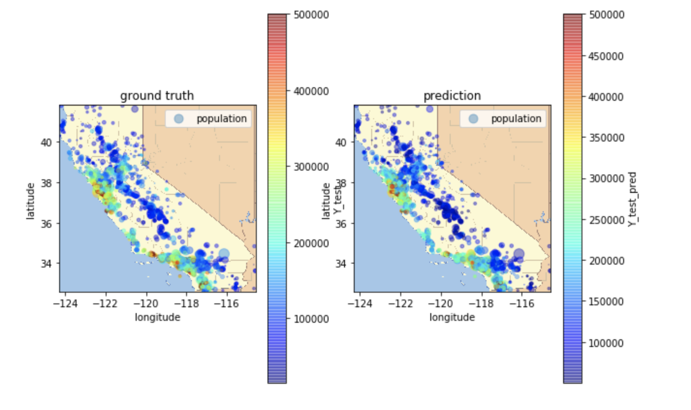
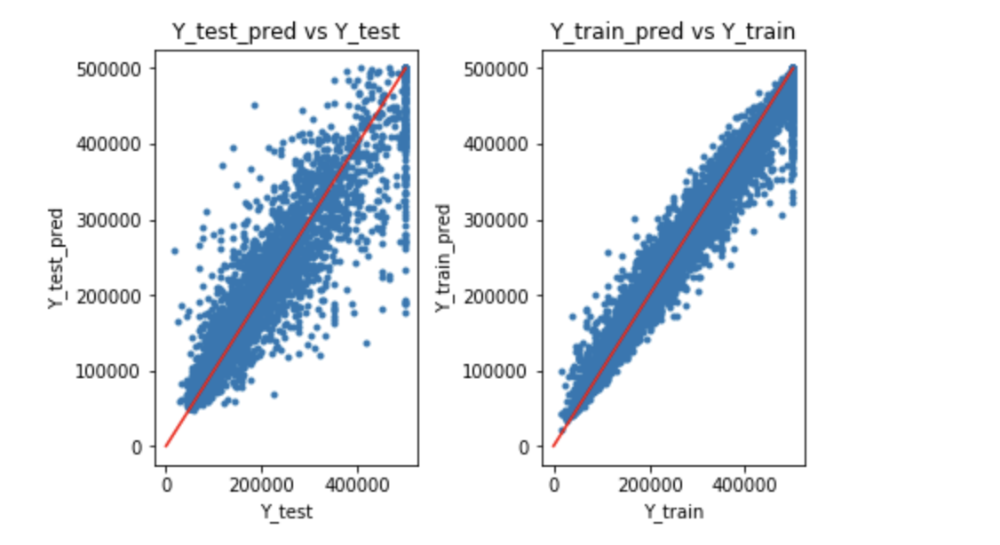
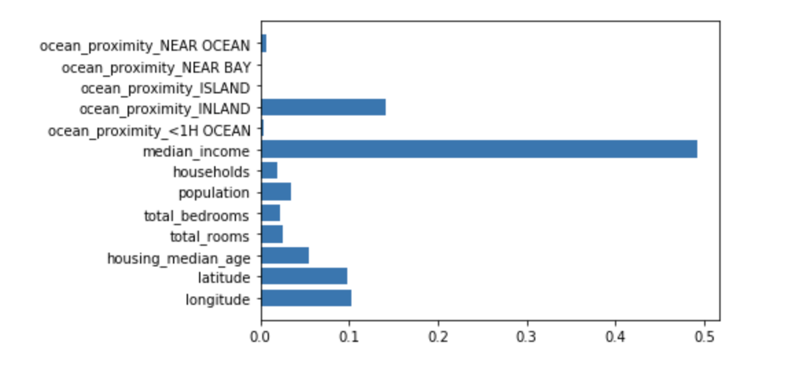

# House Valuator

A lot of factors contribute to the overall value of a house e.g median household income, location. etc   

To put this to the test, we have the dataset `housing.csv` on which we shall run our analysis using multiple regression models to find out which one works the best in predicting the value of the house  
In this task we shall try to estimate the value of a house based on multiple factors.

The inspiration behind this project was from Zillow's Challenge on their dataset with a prize of $1.2 Million

## Plotting the data, we can clearly see a correlation exists

## We shall try out a bunch of regression models to see which one works best

# 1. LinearRegression by sklearn.linear_model

# 2. KNeighborsRegressor from sklearn.neighbors

# 3. RandomForestRegressor from sklearn.ensemble

# Feature Selection

We can see that most important two features are `median_income` and `ocean_proximity_inland`   
To further improve our model, we can select the top-N important features and re-do the regression.   
The purpose of feature selection is to remove the features which are irrelevant to the task